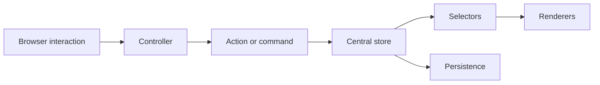

# Message Flow Designer

A lightweight, fully client-side web application for designing and animating message/event flows between software components.

The application is built with HTML5, CSS3, vanilla JavaScript, native ES modules, SVG, and browser-native APIs. It does not require a backend or a production build step and can be hosted with GitHub Pages.

### Runtime compatibility note

`index.html` now boots through `src/runtime/app.js`, a classic browser script generated from the preserved legacy compatibility layer. This keeps the application usable by opening `index.html` directly from the file system and on GitHub Pages. The modular ES source under `src/` remains the target architecture for incremental extraction and tests.

## Run locally

Open `index.html` directly in a modern browser, or run a simple static server:

```bash
python3 -m http.server 8080
```

Then open `http://localhost:8080`.

## Development setup

```bash
npm install
npm run test
npm run lint
npm run format
```

The npm tooling is development-only. The production app remains static and framework-free.

## Project structure

```text
src/
├── main.js                     # Composition root
├── config/                     # Defaults and constants
├── model/                      # Domain factories and validation
├── state/                      # Store, actions, reducers, commands, history
├── canvas/                     # Geometry and canvas-controller extraction points
├── flow/                       # Flow ordering and flow-panel extraction points
├── animation/                  # Animation and presentation state/services
├── storage/                    # Import/export, schema, migrations, local persistence
├── ui/                         # Toolbar/dialog/context-menu/notification helpers
├── registry/                   # Shape, connector, and tool registries
├── styles/                     # CSS split into focused files
└── legacy/                     # Compatibility runtime preserving current behavior
```

## Architecture flow



The new modules establish a controlled data flow. The current production runtime is wrapped in `src/legacy/bootstrapLegacyApp.js` to preserve behavior during incremental extraction.

## Adding a shape

1. Add a shape module or shape definition.
2. Register it through `src/registry/shapeRegistry.js`.
3. Add tests for ports/bounds if needed.
4. Add toolbar metadata in the UI extraction layer.

## Adding a connector type

1. Add geometry/path logic in `src/canvas/geometry.js` or a new connector module.
2. Register it through `src/registry/connectorRegistry.js`.
3. Add tests for path calculation and label positioning.

## Adding a canvas tool

1. Implement the tool controller with `activate`, `deactivate`, and pointer handlers.
2. Register it through `src/registry/toolRegistry.js`.
3. Dispatch explicit actions/commands rather than mutating shared state directly.

## JSON files

Exported project files are versioned through `schemaVersion`. See `docs/JSON_SCHEMA.md` and `src/storage/migrations.js`.

## Deployment

This repository can be hosted as a static website. For GitHub Pages, publish the repository root or configure Pages to serve the default branch.

### Latest UI refinements

The runtime includes handle-based flow-step reordering, a more prominent presentation entry point, presentation-mode toolbar cleanup, and a more structured edit-step dialog.


### Recent UI refinements

The flow panel opens by default and can be collapsed or expanded using the bottom-left panel icon. The Edit Step dialog uses up/down controls to reorder steps, animation speed is controlled by a continuous speed slider, and the main animation controls use icon-only buttons for a cleaner presentation toolbar.

- UI polish: resizable flow panel, corrected collapse/expand icon direction, radio-based play mode, centered playback controls, and disabled step navigation in auto mode.
